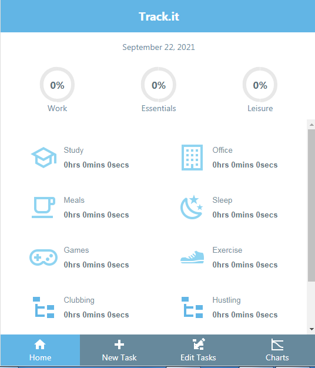

# Task Tracker

> A react single-page application to track how much time a user spends on everyday tasks. There are three major categories. An administrator can add to or remove these categories. A user can add a Task to the Categories, and the app will track the total time the user is spending on each Category daily.



## Built With

- React
- Redux

## Requirements

- The App makes API calls to a companion backend project - tracker-api. You can find the repo on [github](https://github.com/chasscepts/tracker-api).

## Live Demo

[demo](https://tram.netlify.app/)

## Getting Started

To get a local copy up and running follow these steps on the command line.

```bash

  # Clone the project from it's github repo.

  $ git clone https://github.com/chasscepts/tracker

  # Change directory to the root of project

  $ cd tracker

  # Install all dependencies

  $ npm install

  # Open app in your local browser

  $ npm run start

  # To run the tests

  $ npm run test

  # To build the project for production

  $ npm run build

```

## Authors

👤 **Obetta Francis**

[](https://github.com/chasscepts) [](https://twitter.com/chasscepts) [](https://www.linkedin.com/in/chasscepts/)

## 🤝 Contributing

Contributions, issues, and feature requests are welcome!

Feel free to check the [issues page](https://github.com/chasscepts/tracker/issues).

## Show your support

Give a ⭐️ if you like this project!

## Acknowledgments
- Design idea by [Nelson Sakwa on Behance](https://www.behance.net/sakwadesignstudio)
- [Official Game Site](https://www.ageofempires.com/games/aoeiide/)
- Icons are downloaded from [materialdesignicons](https://materialdesignicons.com/)
- Microverse Community
- Everyone whose code was used in this project

## 📝 License

This project is [MIT](./LICENSE)
